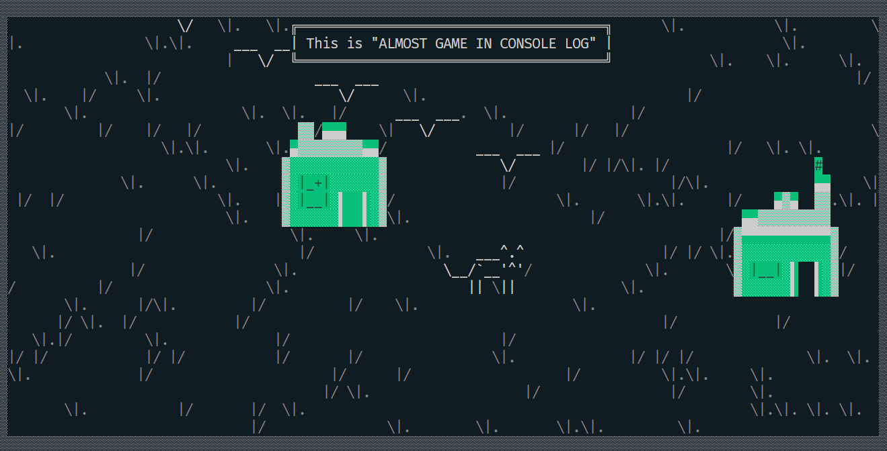

<h1>~~~ALMOST GAME IN CONSOLE LOG~~~</h1>

    
    

        This is what you will see when you launch the 0.1 version
    

    <h3>You can do any of the following:</h3>
    <ol>
        <li>
            Do nothing - This option allows you to simply wait and see what happens.
        </li>
        <li>
            Take a walk - If you need some time to think or relax, you can take a short break from the task at hand.
        </li>
        <li>
            Press the "e" key - This action will allow you to see more pre-prepared messages in the dialog box.
        </li>
    </ol>

<h2 id='wish'> GOOD LUCK HAVING FUN WITH THIS</h2>